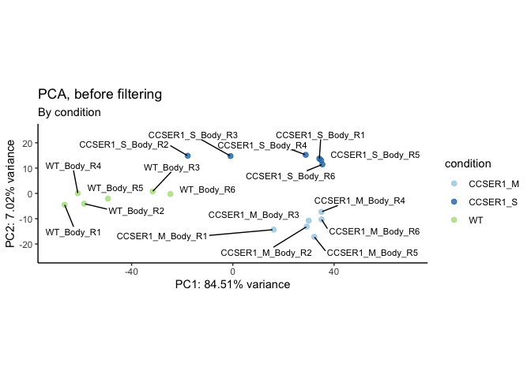
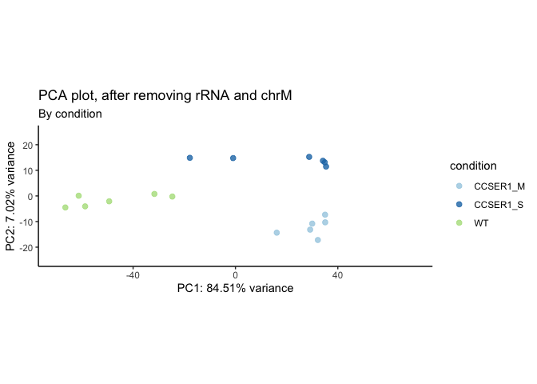

# 01_QC
Qian Hui TAN
2023-06-05

- [<span class="toc-section-number">1</span> 01_QC](#qc)
- [<span class="toc-section-number">2</span> Setup](#setup)
- [<span class="toc-section-number">3</span> Preparing objects for
  DESeq](#preparing-objects-for-deseq)
  - [<span class="toc-section-number">3.1</span> Creating the data
    matrix](#creating-the-data-matrix)
  - [<span class="toc-section-number">3.2</span> Metadata
    wrangling](#metadata-wrangling)
  - [<span class="toc-section-number">3.3</span> How many non-zero
    rows?](#how-many-non-zero-rows)
  - [<span class="toc-section-number">3.4</span> Create DESeq
    object](#create-deseq-object)
- [<span class="toc-section-number">4</span> DESeq QC](#deseq-qc)
  - [<span class="toc-section-number">4.1</span> Dispersion
    estimates](#dispersion-estimates)
  - [<span class="toc-section-number">4.2</span> QC - number of detected
    genes](#qc---number-of-detected-genes)
  - [<span class="toc-section-number">4.3</span> QC -
    clustering](#qc---clustering)
- [<span class="toc-section-number">5</span> Remove rRNA and
  mitochondrial genome](#remove-rrna-and-mitochondrial-genome)
  - [<span class="toc-section-number">5.1</span> Check rRNA
    removed](#check-rrna-removed)
  - [<span class="toc-section-number">5.2</span> QC - number of
    genes](#qc---number-of-genes)
  - [<span class="toc-section-number">5.3</span> QC-
    clustering](#qc--clustering)
- [<span class="toc-section-number">6</span> Check CCSER1
  levels](#check-ccser1-levels)
- [<span class="toc-section-number">7</span> MA plots](#ma-plots)
- [<span class="toc-section-number">8</span> Save output](#save-output)
- [<span class="toc-section-number">9</span> Summary](#summary)
- [<span class="toc-section-number">10</span> Sessioninfo](#sessioninfo)

# 01_QC

In this notebook, we perform quality control on our dataset.

# Setup

``` r
## If output directory doesn't exist, create it
if(!dir.exists("../output")){
    dir.create("../output")
  }
  
if(!dir.exists("../output/01_QC")){
    dir.create("../output/01_QC")
  }
  
output_dir <- "../output/01_QC/"
```

``` r
suppressPackageStartupMessages({
    library(dplyr)
    library(readr)
    library(tidyr)
    library(ggplot2)
    library(janitor)
    library(GEOquery)
    library(DESeq2)
    library(reshape2) # melt function
    library(biomaRt)
    library(GenomicFeatures)
    library(scales)
    library(ggrepel)
    library(pheatmap)
    library(viridis)
    library(lubridate)
    library(DT)
})

source("../scripts/R/clustering_functions.R")
source("../scripts/R/ma_plot_function.R")
```

``` r
# Generic theme
th <- theme(
         plot.title = element_text(size = 20),
         plot.subtitle = element_text(size = 15),
         axis.title.x = element_blank(),
         axis.title.y = element_blank(),
         axis.text.x = element_text(size = 12),
         axis.text.y = element_text(size = 12))

# PCA theme
pca_th <- theme(plot.title = element_text(size = 20),
         axis.title.x = element_text(size = 15), 
         axis.title.y = element_text(size = 15),
         axis.text.x = element_text(size = 12),
         axis.text.y = element_text(size = 12))
```

We first create gene-level annotations:

``` r
### --- Get gene-level annotations (run once) --- ###

dr.gtf.db <- makeTxDbFromGFF("../data/annotations/Danio_rerio.GRCz11.102.chr.gtf.gz", format="gtf")
ensembl.genes = genes(dr.gtf.db)

fish = useEnsembl(biomart = "ENSEMBL_MART_ENSEMBL", 
                  host = "asia.ensembl.org", 
                  dataset = "drerio_gene_ensembl", 
                  version = "102") #change host as needed

bm.annotations = getBM(attributes=c("ensembl_gene_id", "entrezgene_id", "gene_biotype", "description", "zfin_id_symbol"), mart=fish, filters="ensembl_gene_id", values=ensembl.genes$gene_id, uniqueRows=TRUE)

ensembl.genes$zfin_id_symbol = bm.annotations$zfin_id_symbol[ match(ensembl.genes$gene_id, bm.annotations$ensembl_gene_id) ]
ensembl.genes$gene_biotype = bm.annotations$gene_biotype[ match(ensembl.genes$gene_id, bm.annotations$ensembl_gene_id) ]
ensembl.genes$status = bm.annotations$status[ match(ensembl.genes$gene_id, bm.annotations$ensembl_gene_id) ]
ensembl.genes$description = bm.annotations$description[ match(ensembl.genes$gene_id, bm.annotations$ensembl_gene_id) ]
ensembl.genes$entrezgene_id = bm.annotations$entrezgene_id[ match(ensembl.genes$gene_id, bm.annotations$ensembl_gene_id) ]


# save this as RDS so we don't have to keep running it
saveRDS(bm.annotations, file = "../output/01_QC/bm_annotations.RDS")
saveRDS(ensembl.genes, file = "../output/01_QC/ensembl.genes.RDS")
```

``` r
ensembl.genes <- readRDS("../output/01_QC/ensembl.genes.RDS")
```

# Preparing objects for DESeq

## Creating the data matrix

``` r
body = read.delim("../data/rawCounts_Body.txt", sep = "")

# Make gene names as rownames
rownames(body) <- body$X
body <- body[ ,-1]
```

``` r
data = body

# DESeq needs read counts to be integers
data_mat = apply(round(data), c(1,2), as.integer)

head(data_mat)
```

                       CCSER1_M_Body_R1 CCSER1_M_Body_R2 CCSER1_M_Body_R3
    ENSDARG00000000001               46               34               29
    ENSDARG00000000002              649              413              421
    ENSDARG00000000018              170              168              165
    ENSDARG00000000019              571              621              477
    ENSDARG00000000068              746             1123              678
    ENSDARG00000000069              391              455              393
                       CCSER1_M_Body_R4 CCSER1_M_Body_R5 CCSER1_M_Body_R6
    ENSDARG00000000001               50               50               39
    ENSDARG00000000002              487              596              437
    ENSDARG00000000018              214              169              244
    ENSDARG00000000019              568              683              576
    ENSDARG00000000068              791             1080              973
    ENSDARG00000000069              387              518              435
                       CCSER1_S_Body_R1 CCSER1_S_Body_R2 CCSER1_S_Body_R3
    ENSDARG00000000001               27               38               27
    ENSDARG00000000002              349              601              437
    ENSDARG00000000018              207              196              223
    ENSDARG00000000019              570              714              563
    ENSDARG00000000068              901             1040              892
    ENSDARG00000000069              508              495              531
                       CCSER1_S_Body_R4 CCSER1_S_Body_R5 CCSER1_S_Body_R6
    ENSDARG00000000001               42               54               36
    ENSDARG00000000002              386              387              625
    ENSDARG00000000018              202              200              175
    ENSDARG00000000019              640              585              565
    ENSDARG00000000068             1026              931              910
    ENSDARG00000000069              544              460              508
                       WT_Body_R1 WT_Body_R2 WT_Body_R3 WT_Body_R4 WT_Body_R5
    ENSDARG00000000001         46         25         47         33         48
    ENSDARG00000000002        440        451        619        421        444
    ENSDARG00000000018        357        281        247        336        283
    ENSDARG00000000019        649        457        589        561        635
    ENSDARG00000000068       1259       1176        992        939        948
    ENSDARG00000000069        674        631        564        548        703
                       WT_Body_R6
    ENSDARG00000000001         17
    ENSDARG00000000002        622
    ENSDARG00000000018        155
    ENSDARG00000000019        528
    ENSDARG00000000068        812
    ENSDARG00000000069        441

## Metadata wrangling

``` r
df <- tibble(sample_id = colnames(body))

# WT metadata
df_wt <- df[grep("WT", df$sample_id),] %>% 
  separate(sample_id, into = c("condition", "part", "replicate"),
           remove = FALSE)


# non WT metadata
df_ccser1 <- df[grep("CCSER1", df$sample_id),] %>% 
  separate(sample_id, into = c("gene", "mutant_type", "part", "replicate"),
           remove = FALSE) %>% 
  unite(col = "condition", gene:mutant_type)

# combine 
experimental_metadata <- rbind(df_wt, df_ccser1)

head(experimental_metadata)
```

| sample_id  | condition | part | replicate |
|:-----------|:----------|:-----|:----------|
| WT_Body_R1 | WT        | Body | R1        |
| WT_Body_R2 | WT        | Body | R2        |
| WT_Body_R3 | WT        | Body | R3        |
| WT_Body_R4 | WT        | Body | R4        |
| WT_Body_R5 | WT        | Body | R5        |
| WT_Body_R6 | WT        | Body | R6        |

Fix sample order:

``` r
#sample_order <- c("WT_1", "WT_2", "WT_3",
#                  "A9_1", "A9_2", "A9_3",
#                  "C11_1", "C11_2", "C11_3")

#experimental_metadata$sample_id <- factor(experimental_metadata$sample_id, 
#                                          levels = sample_order)


# Specifying which group is the control group to make appropriate contrasts downstream
experimental_metadata$condition <- factor(experimental_metadata$condition)
experimental_metadata$condition <- relevel(experimental_metadata$condition, ref = "WT")
```

DESeq needs the `data_mat` and `experimental_metadata` to be in the same
order! Make sure this is the case.

Check that data_mat has the same order

``` r
data_mat <- data_mat[ ,experimental_metadata$sample_id]
```

``` r
data_mat_nonzero = data_mat[rowSums(data_mat) > 0, ] # Remove non-zero rows
```

## How many non-zero rows?

How many genes are there in the zebrafish genome?

``` r
nrow(data_mat)
```

    [1] 32520

How many genes are expressed (at least 1 read in at least 1 sample)?

``` r
nrow(data_mat_nonzero)
```

    [1] 27321

What percentage is this?

``` r
nrow(data_mat_nonzero)/nrow(data_mat) * 100
```

    [1] 84.01292

## Create DESeq object

``` r
# Create DESeq object
dds = DESeqDataSetFromMatrix(data_mat_nonzero, experimental_metadata, ~ condition)
colnames(dds) = colnames(data_mat_nonzero)

# Relevel coldata
colData(dds)$condition <- as.factor(as.character(colData(dds)$condition))

colnames(dds)
```

     [1] "WT_Body_R1"       "WT_Body_R2"       "WT_Body_R3"       "WT_Body_R4"      
     [5] "WT_Body_R5"       "WT_Body_R6"       "CCSER1_M_Body_R1" "CCSER1_M_Body_R2"
     [9] "CCSER1_M_Body_R3" "CCSER1_M_Body_R4" "CCSER1_M_Body_R5" "CCSER1_M_Body_R6"
    [13] "CCSER1_S_Body_R1" "CCSER1_S_Body_R2" "CCSER1_S_Body_R3" "CCSER1_S_Body_R4"
    [17] "CCSER1_S_Body_R5" "CCSER1_S_Body_R6"

``` r
# Sanity check- make sure that rownames and sample ids for dds match

if(all(rownames(colData(dds)) == colData(dds)$sample_id)){
  print("Sample IDs and rownames match.")
} else {
  stop("Order of data_mat and experimental_metadata don't match. Please check the order.")
}
```

    [1] "Sample IDs and rownames match."

``` r
#Estimates the size factors using the "median ratio method" described by Equation 5 in Anders and Huber (2010)
dds <- estimateSizeFactors(dds) 
#This function obtains dispersion estimates for a count data set
dds <- estimateDispersions(dds)
```

    gene-wise dispersion estimates

    mean-dispersion relationship

    final dispersion estimates

``` r
#This function transforms the count data to the log2 scale in a way which minimizes differences between samples for rows with small counts
rld <- rlog(dds, blind = TRUE) # use blind = TRUE for QC
```

84% of all rows are nonzero.

# DESeq QC

## Dispersion estimates

``` r
## Plot dispersion estimates
plotDispEsts(dds, main = "Dispersion estimates, before filtering")
```


## QC - number of detected genes

Examining our dataset:

``` r
dds
```

    class: DESeqDataSet 
    dim: 27321 18 
    metadata(1): version
    assays(2): counts mu
    rownames(27321): ENSDARG00000000001 ENSDARG00000000002 ...
      ENSDARG00000117826 ENSDARG00000117827
    rowData names(10): baseMean baseVar ... dispOutlier dispMAP
    colnames(18): WT_Body_R1 WT_Body_R2 ... CCSER1_S_Body_R5
      CCSER1_S_Body_R6
    colData names(5): sample_id condition part replicate sizeFactor

We plot a few key metrics to check our data quality:

``` r
plt_title = "Before Filtering"
```

<div class="panel-tabset">

### Read counts per sample

``` r
total_counts <- as.data.frame(colSums(counts(dds)))
colnames(total_counts) <- "total_counts"
total_counts$name = rownames(total_counts)
```

``` r
# Plot
ggplot(total_counts, aes(x = name, y = total_counts)) +
    geom_bar(stat = "identity") +
    scale_y_continuous("Read counts", 
                       limits = c(0, 1.5e7),
                       expand = c(0, 0),
                       breaks = seq(0, 1.5e7, 5e6)) +
    geom_hline(yintercept = 1e7, color = "blue", linetype = "dashed") +
    labs(title = "Read counts per sample",
         x = element_blank()) +
    theme_minimal() +
    coord_flip()
```


### Number of genes detected per sample

``` r
detected = apply(counts(dds), 2, function(col) sum(col > 0 ))
detected = as.data.frame(detected)
detected$name = row.names(detected)
                 
ggplot(detected, aes(x=name, y=detected)) + 
                 geom_bar(stat="identity") + 
                 theme_minimal() + 
                 coord_flip() + 
                 scale_y_continuous("Number of Genes detected", expand=c(0,0),
                                    limits = c(0, 30000)
                                    ) + 
                 scale_x_discrete("Sample") +
                 labs(title = "# of genes detected", 
                     subtitle = plt_title) +
                 geom_hline(yintercept = 20000, color = "blue", linetype = "dashed") 
```


### Size factors

``` r
df = data.frame(sample_id = names(sizeFactors(dds)), 
                sizeFactors = sizeFactors(dds))

ggplot(df, aes(x = sample_id, y=sizeFactors)) + 
    geom_bar(stat="identity") + 
    scale_y_continuous(limits=c(0,2), expand=c(0,0)) + 
    labs(title = "Size factors for each sample",
         subtitle = plt_title, 
         x = element_blank()) +
    theme_minimal() + 
    theme(axis.text.x = element_text(angle = 90, hjust=1, 
                                     colour="black", size= 12))
```


### Normalized counts (boxplot)

``` r
nc = counts(dds, normalized=TRUE)
nc.melt = melt(nc)

ggplot(nc.melt, aes(x=Var2, y=value)) + 
    geom_boxplot() + 
    theme_classic() + 
    theme(axis.text.x = element_text(angle = 90, colour="black", hjust = 1,
                                     size = 12)) + 
    scale_x_discrete("Sample") + 
    scale_y_continuous("Normalised counts") +
    labs(title = "Normalized counts",
        subtitle = plt_title) +
    th
```


``` r
nc.threshold = 2e5
test = apply(nc, 1, function(x){ any(x > nc.threshold) })
```

The genes with normalized counts greater than 2^{5} are:

``` r
above_threshold <- as.data.frame(ensembl.genes[names(test[test])])

above_threshold[ ,colnames(above_threshold) %in% 
                   c("gene_id", "gene_biotype", "zfin_id_symbol")]
```

|                    | gene_id            | zfin_id_symbol | gene_biotype   |
|:-------------------|:-------------------|:---------------|:---------------|
| ENSDARG00000002768 | ENSDARG00000002768 | pvalb2         | protein_coding |
| ENSDARG00000053254 | ENSDARG00000053254 | mylpfa         | protein_coding |
| ENSDARG00000067990 | ENSDARG00000067990 | myhz1.1        | protein_coding |
| ENSDARG00000095930 | ENSDARG00000095930 | myha           | protein_coding |
| ENSDARG00000099197 | ENSDARG00000099197 | actc1b         | protein_coding |

All are protein_coding genes.

Plotting the rRNA graph:

``` r
rrna.genes = names(ensembl.genes[ensembl.genes$gene_biotype %in% c("Mt_rRNA", "rRNA")])
percentage.of.rrna = (colSums(counts(dds[ rownames(counts(dds)) %in% rrna.genes])) / colSums(counts(dds))) * 100

percentage.of.rrna = as.data.frame(percentage.of.rrna)
percentage.of.rrna$name = row.names(percentage.of.rrna)
#percentage.of.rrna$name = factor(percentage.of.rrna$name,rev(experimental_metadata$sample_id))
ggplot(percentage.of.rrna, 
       aes(x=name, y=percentage.of.rrna)) + 
        geom_hline(yintercept = 5, color = "blue", linetype = "dashed") +
        geom_bar(stat="identity") + 
        theme_classic() + 
        coord_flip() + 
        scale_y_continuous("% rRNA", expand=c(0,0), limits = c(0, 30)) +
        labs(title = "% rRNA") 
```


Checking summary statistics for rRNA:

``` r
summary(percentage.of.rrna$percentage.of.rrna)
```

       Min. 1st Qu.  Median    Mean 3rd Qu.    Max. 
    0.03349 0.05205 0.06324 0.06014 0.06728 0.07497 

There’s a tiny amount of rRNA (\< 0.07%). This is good - our samples
don’t show large amounts of rRNA present.

### Proportions of gene biotypes

``` r
pc = ensembl.genes$gene_id[ensembl.genes$gene_biotype == "protein_coding"]
pg = ensembl.genes$gene_id[ensembl.genes$gene_biotype %in% unique(ensembl.genes$gene_biotype)[grep("pseudogene", unique(ensembl.genes$gene_biotype))]]
lc = ensembl.genes$gene_id[ensembl.genes$gene_biotype == "lincRNA"]

totalcounts.pc = colSums(counts(dds)[rownames(counts(dds)) %in% pc,])
totalcounts.pg = colSums(counts(dds)[rownames(counts(dds)) %in% pg,])
totalcounts.lc = colSums(counts(dds)[rownames(counts(dds)) %in% lc,])

totalcounts.other = colSums(counts(dds)[!(rownames(counts(dds)) %in% c(lc,pc,pg)),])

counts.by.biotype = data.frame(name = names(totalcounts.pc),
                         protein_coding = totalcounts.pc,
                         pseudogene = totalcounts.pg,
                         lincRNA = totalcounts.lc,
                         other = totalcounts.other
                         
                         )

#counts.by.biotype$name = factor(counts.by.biotype$name, experimental_metadata$sample_id)

counts.by.biotype = as.data.frame(t(apply(counts.by.biotype[,2:5], 1, function(x){ 100 * (x / sum(x)) }) ))
counts.by.biotype$name = names(totalcounts.pc)
#counts.by.biotype$name = factor(counts.by.biotype$name, #experimental_metadata$sample_id)

counts.by.biotype.melt = melt(counts.by.biotype)
```

    Using name as id variables

``` r
ggplot(counts.by.biotype.melt, aes(x=name, y=value, fill=variable)) +  
    geom_bar(stat="identity") + 
    theme_classic() + 
    scale_y_continuous("% reads", labels = dollar_format(suffix = "%", prefix = ""),  
                       expand=c(0,0)) + scale_x_discrete("Sample") + 
    theme(axis.text.x = element_text(angle = 90, colour="black", #family="Arial", 
                                     hjust = 1, size=12)) +
    labs(title = "Proportions of gene biotypes", 
        subtitle = plt_title) 
```


Most genes are protein-coding, as expected.

</div>

## QC - clustering

We perform 3 types of Quality Control to assess our DESeq dataset:

- Correlation matrix heatmap
- Hierarchical clustering
- PCA

<div class="panel-tabset">

### Correlation matrix heatmap

``` r
### Extract the rld matrix from the object
rld_mat <- assay(rld)  
### Compute pairwise correlation values
rld_cor <- cor(rld_mat)
### Plot heatmap
pheatmap(rld_cor, main = "Correlation heatmap, before filtering")
```


### Hierarchical clustering

``` r
sampleDists <- dist(t(assay(rld)))
plot(hclust(sampleDists), main = paste0("Cluster Dendrogram, ", plt_title))
```


### PCA

``` r
make_pca(rld, intgroup = "condition",
         title = "PCA, before filtering")
```


### PCA, labelled

``` r
make_pca(rld, intgroup = "condition", label = TRUE,
         title = "PCA, before filtering")
```



### PCA, by size factor

``` r
make_pca(rld, intgroup = "sizeFactor",
         title = "PCA plot, before filtering") +
  scale_color_viridis(option = "A")
```


</div>

This looks good - PC1 and 2 both capture biological variation. Samples
also cluster within conditions.

All our key metrics look good. Read counts per sample, number of genes
per sample are all high, and relatively similar across all samples. Most
genes are protein-coding, as expected. Data is of high quality.

# Remove rRNA and mitochondrial genome

We remove all genes that map to rRNA, as well as the mitochondrial
chromosome before we proceed with downstream analysis.

``` r
plt_title = "after removing rRNA and mitochondrial genome"
```

Checking MT chromosome intact:

``` r
in_dds = ensembl.genes[na.omit(match(rownames(counts(dds)), ensembl.genes$gene_id)), ]
table(seqnames(in_dds))
```


       1    2    3    4    5    6    7    8    9   10   11   12   13   14   15   16 
    1256 1330 1447 1703 1431 1072 1488 1113  953  947  922  886  948  891 1009 1138 
      17   18   19   20   21   22   23   24   25   MT 
     960  839  982 1068  964 1089  962  734  838   16 

Remove MT chromosome, rerun DESeq:

``` r
# Remove mitochondrial genome
mit_genes <- ensembl.genes[seqnames(ensembl.genes) %in% "MT", ]$gene_id
dds_rm_mit <- dds[!rownames(counts(dds)) %in% mit_genes, ]

# Remove rRNA
dds_filt = dds_rm_mit[!(row.names(counts(dds_rm_mit)) %in% 
                   ensembl.genes$gene_id[ensembl.genes$gene_biotype %in% 
                                           c("rRNA", "snoRNA", "snRNA", "Mt_rRNA")]), ]
dds_filt = dds_filt[rowSums(counts(dds_filt)) > 0, ]

# Re-estimate dispersions
dds_filt <- estimateSizeFactors(dds_filt) 
dds_filt <- estimateDispersions(dds_filt)
```

    found already estimated dispersions, replacing these

    gene-wise dispersion estimates

    mean-dispersion relationship

    final dispersion estimates

``` r
rld_filt <- rlog(dds, blind = TRUE) # use blind = TRUE for QC
```

Check that mitochondrial genome has been removed:

``` r
in_dds = ensembl.genes[na.omit(match(rownames(counts(dds_filt)), ensembl.genes$gene_id)), ]
table(seqnames(in_dds))
```


       1    2    3    4    5    6    7    8    9   10   11   12   13   14   15   16 
    1250 1321 1446 1693 1426 1070 1481 1112  951  945  921  886  947  889 1009 1136 
      17   18   19   20   21   22   23   24   25   MT 
     960  836  978 1057  961 1089  959  733  835    0 

## Check rRNA removed

``` r
rrna.genes = names(ensembl.genes[ensembl.genes$gene_biotype %in% c("Mt_rRNA", "rRNA", 
                                                                   "snoRNA", "snRNA")])

percentage.of.rrna = (colSums(counts(dds_filt[rownames(counts(dds_filt)) %in% rrna.genes])) / colSums(counts(dds_filt))) * 100
percentage.of.rrna = as.data.frame(percentage.of.rrna)
percentage.of.rrna$name = row.names(percentage.of.rrna)
#percentage.of.rrna$name = factor(percentage.of.rrna$name, rev(experimental_metadata$sample_id))


ggplot(percentage.of.rrna, aes(x=name, y=percentage.of.rrna)) +
  geom_bar(stat="identity") + theme_classic() + coord_flip() + scale_y_continuous("% rRNA", expand=c(0,0)) +
  scale_x_discrete("Sample") +
  ggtitle(paste0("% rRNA, ", plt_title))
```


Checking that rRNA percentage is now zero:

``` r
summary(percentage.of.rrna$percentage.of.rrna)
```

       Min. 1st Qu.  Median    Mean 3rd Qu.    Max. 
          0       0       0       0       0       0 

## QC - number of genes

<div class="panel-tabset">

### Size Factors after rRNA removal

``` r
df = data.frame(sample_id = names(sizeFactors(dds_filt)), sizeFactors = sizeFactors(dds_filt))

ggplot(df, aes(x = sample_id, y=sizeFactors)) + 
  geom_bar(stat="identity") + 
  scale_y_continuous(limits=c(0,2), expand=c(0,0)) + 
  theme_classic() + 
  theme(axis.text.x = element_text(angle = 90, hjust=1, colour="black", size=12)) +
  geom_hline(yintercept = 1, color = "blue", linetype = "dashed") +
  ggtitle(paste0("Size Factors, ", plt_title))
```


Summary of size factors:

``` r
summary(sizeFactors(dds_filt))
```

       Min. 1st Qu.  Median    Mean 3rd Qu.    Max. 
     0.9039  0.9681  1.0022  1.0080  1.0325  1.1452 

Size factors for each sample:

``` r
print(sizeFactors(dds_filt))
```

          WT_Body_R1       WT_Body_R2       WT_Body_R3       WT_Body_R4 
           1.0735888        0.9769747        1.0370124        1.0168888 
          WT_Body_R5       WT_Body_R6 CCSER1_M_Body_R1 CCSER1_M_Body_R2 
           1.0187779        0.9878447        0.9651164        0.9527000 
    CCSER1_M_Body_R3 CCSER1_M_Body_R4 CCSER1_M_Body_R5 CCSER1_M_Body_R6 
           0.9038935        0.9964862        0.9236517        1.0764546 
    CCSER1_S_Body_R1 CCSER1_S_Body_R2 CCSER1_S_Body_R3 CCSER1_S_Body_R4 
           0.9617552        1.1452030        1.0991897        1.0094724 
    CCSER1_S_Body_R5 CCSER1_S_Body_R6 
           0.9904995        1.0078157 

### Read counts per sample after rRNA and chrM removal

``` r
total_counts <- as.data.frame(colSums(counts(dds_filt)))
colnames(total_counts) <- "total_counts"
total_counts$name = rownames(total_counts)
```

``` r
# Plot
ggplot(total_counts, aes(x = name, y = total_counts)) +
    geom_bar(stat = "identity") +
    scale_y_continuous("Read counts", 
                       limits = c(0, 1.5e7),
                       expand = c(0, 0),
                       breaks = seq(0, 1.5e7, 0.5e7)) +
    geom_hline(yintercept = 1e7, color = "blue", linetype = "dashed") +
    labs(title = "Read counts per sample",
         subtitle = "after removing chrM and rRNA",
         x = element_blank()) +
    theme_minimal() +
    coord_flip()
```


### Number of genes detected per sample after rRNA and chrM removal

``` r
detected = apply(counts(dds_filt), 2, function(col) sum(col > 0 ))
detected = as.data.frame(detected)
detected$name = row.names(detected)
#detected$name = factor(detected$name, rev(experimental_metadata$sample_id))
                 
ggplot(detected, aes(x=name, y=detected)) + 
                 geom_bar(stat="identity") + 
                 theme_minimal() + 
                 coord_flip() + 
                 scale_y_continuous("Number of Genes detected", expand=c(0,0),
                                    limits = c(0, 30000)) + 
                 scale_x_discrete("Sample") +
                 labs(title = "# of genes detected", 
                     subtitle = plt_title) +
                 geom_hline(yintercept = 20000, color = "blue", linetype = "dashed") 
```


</div>

## QC- clustering

<div class="panel-tabset">

### Heatmap after rRNA removal

``` r
### Extract the vst matrix from the object
rld_mat <- assay(rld_filt)  

### Compute pairwise correlation values
rld_cor <- cor(rld_mat)

### Plot heatmap
pheatmap(rld_cor, main = "Correlation heatmap, after rRNA removal")
```


### Clustering after rRNA removal

``` r
sampleDists <- dist(t(assay(rld_filt)))
plot(hclust(sampleDists), main = paste0("Cluster Dendrogram, ", plt_title))
```


### PCA after rRNA removal

``` r
make_pca(rld_filt, intgroup = "condition",
         title = "PCA plot, after removing rRNA and chrM") 
```



### PCA, labelled

``` r
make_pca(rld_filt, intgroup = "condition", label = TRUE, 
         title = "PCA plot, after removing rRNA and chrM") 
```


### PCA, by size factor

``` r
make_pca(rld_filt, intgroup = "sizeFactor", 
         title = "PCA plot, after removing rRNA and chrM") +
  scale_color_viridis(option = "A")
```

    Scale for colour is already present.
    Adding another scale for colour, which will replace the existing scale.


</div>

# Check CCSER1 levels

We plot the normalized counts of CCSER1 in each sample:

``` r
ccser1_gene <- "ENSDARG00000075919"

# The normalized counts
ccser1_norm <- as.data.frame(counts(dds_filt, normalized = TRUE)[ccser1_gene, ])

ccser1_norm$sample <- rownames(ccser1_norm)
colnames(ccser1_norm) <- c("counts", "sample")
head(ccser1_norm)
```

|            |   counts | sample     |
|:-----------|---------:|:-----------|
| WT_Body_R1 | 55.88732 | WT_Body_R1 |
| WT_Body_R2 | 51.17840 | WT_Body_R2 |
| WT_Body_R3 | 36.64373 | WT_Body_R3 |
| WT_Body_R4 | 68.83742 | WT_Body_R4 |
| WT_Body_R5 | 33.37332 | WT_Body_R5 |
| WT_Body_R6 | 45.55372 | WT_Body_R6 |

``` r
ggplot(ccser1_norm, aes(x = sample, y = counts)) +
  geom_col() +
  labs(title = "CCSER1 counts, normalized") +
  theme_minimal() +
  theme(axis.text.x = element_text(angle = 90)) 
```


# MA plots

Plots to assess whether samples are good replicates.

<div class="panel-tabset">

## WT

``` r
plot_ma_by_rep(condition_combis = generate_condition_combinations(dds_filt, "WT"))
```

## CCSER1_M

``` r
plot_ma_by_rep(condition_combis = generate_condition_combinations(dds_filt, "CCSER1_M"))
```

## CCSER1_S

``` r
plot_ma_by_rep(condition_combis = generate_condition_combinations(dds_filt, "CCSER1_S"))
```

</div>

Everything looks good.

# Save output

``` r
saveRDS(ensembl.genes, file = paste0(output_dir, "ensembl_genes.RDS"))
saveRDS(data_mat, file = paste0(output_dir, "data_mat.RDS"))
saveRDS(experimental_metadata, file = paste0(output_dir, "metadata.RDS"))
saveRDS(dds_filt, file = paste0(output_dir, "dds_filt.RDS"))
```

# Summary

- Everything looks good!
- Possible batch effect with R3 and R6?
- Same conditions cluster together on the PCA, as expected.

# Sessioninfo

``` r
sessionInfo()
```

    R version 4.2.2 (2022-10-31)
    Platform: aarch64-apple-darwin20 (64-bit)
    Running under: macOS Ventura 13.1

    Matrix products: default
    BLAS:   /Library/Frameworks/R.framework/Versions/4.2-arm64/Resources/lib/libRblas.0.dylib
    LAPACK: /Library/Frameworks/R.framework/Versions/4.2-arm64/Resources/lib/libRlapack.dylib

    locale:
    [1] en_US.UTF-8/en_US.UTF-8/en_US.UTF-8/C/en_US.UTF-8/en_US.UTF-8

    attached base packages:
    [1] stats4    stats     graphics  grDevices utils     datasets  methods  
    [8] base     

    other attached packages:
     [1] DT_0.27                     lubridate_1.9.1            
     [3] viridis_0.6.2               viridisLite_0.4.1          
     [5] pheatmap_1.0.12             ggrepel_0.9.3              
     [7] scales_1.2.1                GenomicFeatures_1.50.4     
     [9] AnnotationDbi_1.60.2        biomaRt_2.54.0             
    [11] reshape2_1.4.4              DESeq2_1.38.3              
    [13] SummarizedExperiment_1.28.0 MatrixGenerics_1.10.0      
    [15] matrixStats_0.63.0          GenomicRanges_1.50.2       
    [17] GenomeInfoDb_1.34.9         IRanges_2.32.0             
    [19] S4Vectors_0.36.2            GEOquery_2.66.0            
    [21] Biobase_2.58.0              BiocGenerics_0.44.0        
    [23] janitor_2.2.0               ggplot2_3.4.2              
    [25] tidyr_1.3.0                 readr_2.1.3                
    [27] dplyr_1.1.1                

    loaded via a namespace (and not attached):
     [1] colorspace_2.1-0         rjson_0.2.21             ellipsis_0.3.2          
     [4] snakecase_0.11.0         XVector_0.38.0           rstudioapi_0.14         
     [7] farver_2.1.1             bit64_4.0.5              fansi_1.0.4             
    [10] xml2_1.3.3               codetools_0.2-19         cachem_1.0.7            
    [13] geneplotter_1.76.0       knitr_1.42               jsonlite_1.8.4          
    [16] Rsamtools_2.14.0         annotate_1.76.0          dbplyr_2.3.0            
    [19] png_0.1-8                compiler_4.2.2           httr_1.4.5              
    [22] assertthat_0.2.1         Matrix_1.5-3             fastmap_1.1.1           
    [25] limma_3.54.1             cli_3.6.1                htmltools_0.5.4         
    [28] prettyunits_1.1.1        tools_4.2.2              gtable_0.3.3            
    [31] glue_1.6.2               GenomeInfoDbData_1.2.9   rappdirs_0.3.3          
    [34] Rcpp_1.0.10              vctrs_0.6.1              Biostrings_2.66.0       
    [37] rtracklayer_1.58.0       xfun_0.37                stringr_1.5.0           
    [40] timechange_0.2.0         lifecycle_1.0.3          restfulr_0.0.15         
    [43] XML_3.99-0.13            zlibbioc_1.44.0          hms_1.1.2               
    [46] parallel_4.2.2           RColorBrewer_1.1-3       yaml_2.3.7              
    [49] curl_5.0.0               memoise_2.0.1            gridExtra_2.3           
    [52] stringi_1.7.12           RSQLite_2.3.1            BiocIO_1.8.0            
    [55] filelock_1.0.2           BiocParallel_1.32.6      rlang_1.1.0             
    [58] pkgconfig_2.0.3          bitops_1.0-7             evaluate_0.20           
    [61] lattice_0.20-45          purrr_1.0.1              labeling_0.4.2          
    [64] htmlwidgets_1.6.1        GenomicAlignments_1.34.0 bit_4.0.5               
    [67] tidyselect_1.2.0         plyr_1.8.8               magrittr_2.0.3          
    [70] R6_2.5.1                 generics_0.1.3           DelayedArray_0.24.0     
    [73] DBI_1.1.3                pillar_1.9.0             withr_2.5.0             
    [76] KEGGREST_1.38.0          RCurl_1.98-1.12          tibble_3.2.1            
    [79] crayon_1.5.2             utf8_1.2.3               BiocFileCache_2.6.0     
    [82] tzdb_0.3.0               rmarkdown_2.20           progress_1.2.2          
    [85] locfit_1.5-9.7           grid_4.2.2               data.table_1.14.8       
    [88] blob_1.2.4               digest_0.6.31            xtable_1.8-4            
    [91] munsell_0.5.0           
