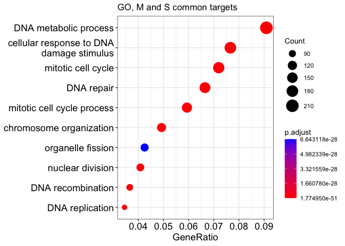
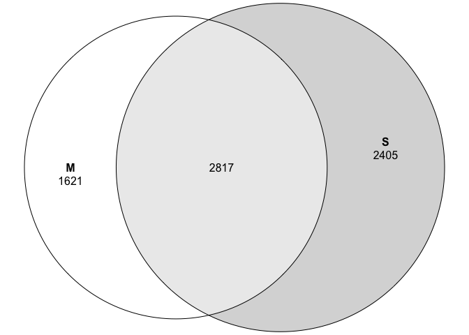

# 02_DE
Qian Hui TAN
2023-05-22

- [<span class="toc-section-number">1</span> 02c_DE_MvsS](#c_de_mvss)
- [<span class="toc-section-number">2</span> Setup](#setup)
  - [<span class="toc-section-number">2.1</span> Function](#function)
  - [<span class="toc-section-number">2.2</span> DESeq](#deseq)
- [<span class="toc-section-number">3</span> Volcano
  Plots](#volcano-plots)
  - [<span class="toc-section-number">3.1</span> S vs WT](#s-vs-wt)
  - [<span class="toc-section-number">3.2</span> M vs WT](#m-vs-wt)
  - [<span class="toc-section-number">3.3</span> Compile and
    export](#compile-and-export)
- [<span class="toc-section-number">4</span> Pairwise comparison
  plots](#pairwise-comparison-plots)
  - [<span class="toc-section-number">4.1</span> M-S-all](#m-s-all)
    - [<span class="toc-section-number">4.1.1</span> Common (top right
      and bottom left
      quadrant)](#common-top-right-and-bottom-left-quadrant)
  - [<span class="toc-section-number">4.2</span> M-S-filt](#m-s-filt)
- [<span class="toc-section-number">5</span> Venn
  diagram](#venn-diagram)

# 02c_DE_MvsS

In this notebook, we analyze how similar CCSER1_S and CCSER1_M are. We
do this in two ways:

- Pairwise crossplot
- Venn diagram

For convenience, we refer to CCSER1_M as M, and CCSER1_S as S.

In essence, we are asking: If a gene goes up in S, does it also go up in
M? Do both M and S affect similar, or different pathways?

# Setup

``` r
source("../scripts/R/functions.R")
source("../scripts/R/clustering_functions.R")
source("../scripts/R/DE_functions.R")
suppressPackageStartupMessages({
  library(DESeq2)
  library(GenomicFeatures)
  library(RColorBrewer)
  library(gplots)
  library(biomaRt)
  library(grid)
  library(gridExtra)
  library(ggplot2)
  library(lattice)
  library(reshape)
  library(geneplotter)
  library(ggrepel)
  library(limma)
  library(tidyverse)
  library(eulerr)
  library(gghighlight)
  library(clusterProfiler)
  library(org.Dr.eg.db)
    # For GSEA
  library(fgsea) #biocmanager install
  library(msigdbr)
  library(knitr)
})
```

``` r
## If the output directory doesn't exist, create it
if(!dir.exists("../output/02_DE")){
  dir.create("../output/02_DE")
}

output_dir <- "../output/02_DE/"
```

## Function

``` r
highlight_reactome <- function(pathways,
                               df_plot,
                               subtitle = "subtitle",
                               label = FALSE){

  df_plot <- df_plot %>% 
    mutate(signif = case_when(
      pathway %in% pathways & M_padj < 0.1 & S_padj < 0.1 ~ "both_signif",
      pathway %in% pathways & M_padj < 0.1 ~ "M_signif", 
      pathway %in% pathways & S_padj < 0.1 ~ "S_signif",
      pathway %in% pathways ~ "NS",
      TRUE ~ "NA"
    )
    )
  
  df_plot$sig <- factor(df_plot$sig, 
                             levels = c("both_signif",
                                        "M_signif", "S_signif",
                                        "NS", "NA"))
  suppressWarnings(
    print(ggplot(df_plot,
         aes(x = S_nes, y = M_nes, color = sig)) +
    geom_point(alpha = 0.6) +
    geom_vline(xintercept = 0, color = "blue", linetype = "dashed") +
    geom_hline(yintercept = 0, color = "blue", linetype = "dashed") +
    gghighlight::gghighlight(sig %in% c("both_signif", "M_signif", "S_signif",
                                        "NS"),
                             use_direct_label = label,
                             label_key = pathway) +
    scale_color_manual(values = c("red", "forestgreen", "blue", "black", "grey50"),
                       breaks = c("both_signif", "M_signif", "S_signif", "NS",
                                  "NA")) +
    scale_x_continuous(limits = c(-3, 3)) +
    scale_y_continuous(limits = c(-3, 3)) +
    labs(title = "Reactome enrichment scores",
         subtitle = subtitle) +
    coord_fixed() +
    theme_light())
    
  )

  df_plot <- df_plot %>% 
    filter(pathway %in% pathways) %>% 
    arrange(sig)
  
  return(df_plot)

}
```

## DESeq

``` r
dds = readRDS("../output/01_QC/dds_filt.RDS")
ensembl.genes= readRDS("../output/01_QC/ensembl.genes.RDS")
lfc.threshold = log2(1.5)

#ls_gene <- read.csv("../output/01b_prep_genelist/matched_gene_list.csv")

dim(dds)
```

    [1] 27226    18

``` r
# Removing lowly expressed genes, only to be done once at the start of the differential expression step
filter = apply(counts(dds, normalized = TRUE), 1, function(x){ mean(x) >= 10 })
dds = dds[filter, ]
dim(dds)
```

    [1] 19722    18

``` r
dds <- DESeq(dds, test = "Wald", parallel = TRUE)
```

    using pre-existing size factors

    estimating dispersions

    gene-wise dispersion estimates: 6 workers

    mean-dispersion relationship

    final dispersion estimates, fitting model and testing: 6 workers

``` r
rld <- rlog(dds, blind = FALSE) # blind = FALSE for downstream DE

# Set WT as reference level
colData(dds)$condition <- relevel(colData(dds)$condition, ref = "WT")

design(dds) 
```

    ~condition

List of samples:

``` r
colData(dds)$sample_id
```

     [1] "WT_Body_R1"       "WT_Body_R2"       "WT_Body_R3"       "WT_Body_R4"      
     [5] "WT_Body_R5"       "WT_Body_R6"       "CCSER1_M_Body_R1" "CCSER1_M_Body_R2"
     [9] "CCSER1_M_Body_R3" "CCSER1_M_Body_R4" "CCSER1_M_Body_R5" "CCSER1_M_Body_R6"
    [13] "CCSER1_S_Body_R1" "CCSER1_S_Body_R2" "CCSER1_S_Body_R3" "CCSER1_S_Body_R4"
    [17] "CCSER1_S_Body_R5" "CCSER1_S_Body_R6"

Run Wald test

``` r
wald_dds = nbinomWaldTest(dds)
```

Check names of coefficients

``` r
resultsNames(wald_dds)
```

    [1] "Intercept"                "condition_CCSER1_M_vs_WT"
    [3] "condition_CCSER1_S_vs_WT"

# Volcano Plots

## S vs WT

``` r
results_S_WT = get_dds_res(wald_dds, 
                             contrast = c("condition", "CCSER1_S", "WT"),
                             ensembl.genes, 
                             shrink = TRUE)
```

    [1] "condition_CCSER1_S_vs_WT"

    using 'apeglm' for LFC shrinkage. If used in published research, please cite:
        Zhu, A., Ibrahim, J.G., Love, M.I. (2018) Heavy-tailed prior distributions for
        sequence count data: removing the noise and preserving large differences.
        Bioinformatics. https://doi.org/10.1093/bioinformatics/bty895

``` r
hist(results_S_WT$pvalue)
```


``` r
### Volcano plot
generate_volcano(results_S_WT, "S", "WT")
```

    Warning: Removed 22 rows containing missing values (`geom_point()`).


## M vs WT

``` r
results_M_WT = get_dds_res(wald_dds, 
                             contrast = c("condition", "CCSER1_M", "WT"),
                             ensembl.genes, 
                             shrink = TRUE)
```

    [1] "condition_CCSER1_M_vs_WT"

    using 'apeglm' for LFC shrinkage. If used in published research, please cite:
        Zhu, A., Ibrahim, J.G., Love, M.I. (2018) Heavy-tailed prior distributions for
        sequence count data: removing the noise and preserving large differences.
        Bioinformatics. https://doi.org/10.1093/bioinformatics/bty895

``` r
hist(results_M_WT$pvalue)
```


``` r
### Volcano plot
generate_volcano(results_M_WT, "M", "WT")
```

    Warning: Removed 13 rows containing missing values (`geom_point()`).


## Compile and export

``` r
## Saving this to compile later

compname <- "M_vs_WT"

M_vs_WT <- results_M_WT[ ,c("baseMean", "log2FoldChange", "padj")]
colnames(M_vs_WT) <- c(paste0(compname, "_baseMean"),
                         paste0(compname, "_log2fc"), 
                         paste0(compname, "_padj"))
M_vs_WT$lfcShrink = TRUE


compname <- "S_vs_WT"

S_vs_WT <- results_S_WT[ ,c("baseMean", "log2FoldChange", "padj")]
colnames(S_vs_WT) <- c(paste0(compname, "_baseMean"),
                         paste0(compname, "_log2fc"), 
                         paste0(compname, "_padj"))
```

Check that they have same number of rows:

``` r
nrow(M_vs_WT) == nrow(S_vs_WT)
```

    [1] TRUE

``` r
df_compiled <- cbind(M_vs_WT, S_vs_WT)

head(df_compiled)
```

    DataFrame with 6 rows and 7 columns
                       M_vs_WT_baseMean M_vs_WT_log2fc M_vs_WT_padj lfcShrink
                              <numeric>      <numeric>    <numeric> <logical>
    ENSDARG00000000001          38.0096    -0.10878876     0.664956      TRUE
    ENSDARG00000000002         485.4449    -0.14489732     0.512082      TRUE
    ENSDARG00000000018         219.3218     0.00362316     0.992233      TRUE
    ENSDARG00000000019         582.1684    -0.03446586     0.871885      TRUE
    ENSDARG00000000068         949.6341    -0.00996952     0.972271      TRUE
    ENSDARG00000000069         506.3664     0.11648518     0.521089      TRUE
                       S_vs_WT_baseMean S_vs_WT_log2fc S_vs_WT_padj
                              <numeric>      <numeric>    <numeric>
    ENSDARG00000000001          38.0096     -0.2179048   0.39652257
    ENSDARG00000000002         485.4449     -0.0666257   0.74457937
    ENSDARG00000000018         219.3218      0.4517835   0.00698567
    ENSDARG00000000019         582.1684     -0.1059383   0.37894666
    ENSDARG00000000068         949.6341      0.1013507   0.52631309
    ENSDARG00000000069         506.3664      0.3703173   0.00437912

``` r
write.csv(df_compiled, file = paste0(output_dir, "master_de_list.csv"))
```

# Pairwise comparison plots

How similar are M and S? In other words, if a gene goes up in M vs WT,
does it also go up in S vs WT?

To answer this question, we use a pairwise crossplot. We plot
**log2FoldChange(S vs WT)** on the x-axis, and the **log2FoldChange(M vs
WT)** on the y-axis.

We can think of this as a 2D volcano plot, where one volcano plot is on
the x axis while the other is on the y-axis.

This divides the plot into 4 quadrants:

- Top right: Up in S, up in M
- Bottom left: Down in S, down in M
- Top left: Down in S, up in M
- Bottom right: Up in S, down in M

which correspond to downregulation and upregulation respectively.

## M-S-all

``` r
### Note the order of S and WT - S here is the numerator, WT is the denominator
c1_WT = results(wald_dds, contrast = c("condition", "CCSER1_S", "WT"),  
                                filter=rowMeans(counts(wald_dds, normalized=TRUE)), 
                                test="Wald", alpha=0.1, independentFiltering=TRUE)

c1_WT <- lfcShrink(wald_dds, 
                    coef = "condition_CCSER1_S_vs_WT", 
                    res = c1_WT, 
                    type = "apeglm", parallel = TRUE)
```

    using 'apeglm' for LFC shrinkage. If used in published research, please cite:
        Zhu, A., Ibrahim, J.G., Love, M.I. (2018) Heavy-tailed prior distributions for
        sequence count data: removing the noise and preserving large differences.
        Bioinformatics. https://doi.org/10.1093/bioinformatics/bty895

``` r
c2_WT = results(wald_dds, contrast = c("condition", "CCSER1_M", "WT"),  
                                filter=rowMeans(counts(wald_dds, normalized=TRUE)), 
                                test="Wald", alpha=0.1, independentFiltering=TRUE)

c2_WT <- lfcShrink(wald_dds, 
                    coef = "condition_CCSER1_M_vs_WT", 
                    res = c2_WT,
                    type = "apeglm", parallel = TRUE)
```

    using 'apeglm' for LFC shrinkage. If used in published research, please cite:
        Zhu, A., Ibrahim, J.G., Love, M.I. (2018) Heavy-tailed prior distributions for
        sequence count data: removing the noise and preserving large differences.
        Bioinformatics. https://doi.org/10.1093/bioinformatics/bty895

``` r
dat <- data.frame(
  gene_id = rownames(c1_WT),
  c1_vs_WT_fc = c1_WT$log2FoldChange, 
  c1_vs_WT_padj = c1_WT$padj,
  c2_vs_WT_fc = c2_WT$log2FoldChange,
  c2_vs_WT_padj = c2_WT$padj)

dat$gene_name = ensembl.genes$external_gene_name[match(dat$gene_id, ensembl.genes$gene_id)]

# Plot
ggplot(dat, aes(x = c1_vs_WT_fc, y = c2_vs_WT_fc, label = gene_id)) +
  geom_point(alpha = 0.5) +
  geom_hline(yintercept = lfc.threshold, color = "darkblue", linetype = "dashed") +
  geom_hline(yintercept = -lfc.threshold, color = "darkblue", linetype = "dashed") +
  geom_vline(xintercept = -lfc.threshold, color = "darkblue", linetype = "dashed") +
  geom_vline(xintercept = lfc.threshold, color = "darkblue", linetype = "dashed") +
  labs(title = "S vs M",
       subtitle = "All genes",
       x = "log2fc(S vs WT)", 
       y = "log2fc(M vs WT)") +
  scale_x_continuous(limits = c(-6, 6), breaks = c(-20, -3, -0.58, 
                                                    0.58, 3, 20)) +
  scale_y_continuous(limits = c(-6, 6), breaks = c(-20, -3, -0.58,
                                                    0.58, 3, 20)) +
  gghighlight::gghighlight(abs(c1_vs_WT_fc) > lfc.threshold & abs(c2_vs_WT_fc) > lfc.threshold,
                           line_label_type = "ggrepel_label") +
  theme_light() +
  coord_fixed()
```

    Warning: Could not calculate the predicate for layer 2, layer 3, layer 4, layer
    5; ignored

    Warning: Removed 268 rows containing missing values (`geom_point()`).

    Warning: Removed 28 rows containing missing values (`geom_point()`).


### Common (top right and bottom left quadrant)

These two quadrants contain genes that are changing **similarly** in M
and S. In other words, if this gene is upregulated in M, it is also
upregulated in S.

We keep only genes that have an absolute fold change of \> 1.5 - in
other words, the black dots in the top right and bottom left quadrant of
the previous plot. For now, we will not implement any filtering based on
`padj`.

<div class="panel-tabset">

#### GO enrichments

**Number of genes (without filtering for padj):**

``` r
top_right <- dat[(dat$c1_vs_WT_fc) > lfc.threshold & (dat$c2_vs_WT_fc) > lfc.threshold, ]$gene_id
bottom_left <- dat[(dat$c1_vs_WT_fc) < -lfc.threshold & (dat$c2_vs_WT_fc) < -lfc.threshold, ]$gene_id

signif_genes <- c(top_right, bottom_left)

common_signif <- signif_genes

length(signif_genes)
```

    [1] 412

**GO enrichment:**

``` r
ego <- plotEGO_dr(signif_genes, universe = rownames(dds), 
               ont = "BP",
               title = "GO, M and S common targets")
```

    Running GO for organism = zebrafish



    [1] "37 enrichments found"

#### KEGG enrichments

``` r
# Plot
ekegg <- plotKEGG_dr(get_entrez(ensembl_ids = signif_genes, 
                                ensembl_genes = ensembl.genes),
                     title = "KEGG, M and S common targets")
```

    Running KEGG for organism = zebrafish

    Reading KEGG annotation online: "https://rest.kegg.jp/link/dre/pathway"...

    Reading KEGG annotation online: "https://rest.kegg.jp/list/pathway/dre"...

    Reading KEGG annotation online: "https://rest.kegg.jp/conv/ncbi-geneid/dre"...

    Warning in plotKEGG_dr(get_entrez(ensembl_ids = signif_genes, ensembl_genes =
    ensembl.genes), : No KEGG enrichment found. Returning a NA tibble.

``` r
# Table
ekegg[ ,colnames(ekegg) %in% c("Description", "GeneRatio", "p.adjust", "geneID")]
```

| Description |
|:------------|
| NA          |

#### Summary

GO: M and S share some common targets - cell adhesion, IL-4, IL-17,
epithelial cell proliferation and migration.

KEGG: Nothing

</div>

## M-S-filt

Filter and only keep genes that have padj \< 0.1 in either comparisons

Filter and plot:

``` r
# Keep only genes with padj < 0.1 in at least 1 comparison
dat_filt <- na.omit(dat[dat$c1_vs_WT_padj < 0.1 & dat$c2_vs_WT_padj < 0.1, ])

# Plot
ggplot(dat_filt, aes(x = c1_vs_WT_fc, y = c2_vs_WT_fc, label = gene_id)) +
  geom_point(alpha = 0.5) +
  geom_hline(yintercept = lfc.threshold, color = "darkblue", linetype = "dashed") +
  geom_hline(yintercept = -lfc.threshold, color = "darkblue", linetype = "dashed") +
  geom_vline(xintercept = -lfc.threshold, color = "darkblue", linetype = "dashed") +
  geom_vline(xintercept = lfc.threshold, color = "darkblue", linetype = "dashed") +
  labs(title = "S vs M",
       subtitle = "Filter: padj < 0.1",
       x = "log2fc(S vs WT)", 
       y = "log2fc(M vs WT)") +
  scale_x_continuous(limits = c(-6, 6)) +
  scale_y_continuous(limits = c(-6, 6)) +
  gghighlight::gghighlight(abs(c1_vs_WT_fc) > lfc.threshold & abs(c2_vs_WT_fc) > lfc.threshold,
                           line_label_type = "ggrepel_label") +
  theme_light() +
  coord_fixed()
```

    Warning: Could not calculate the predicate for layer 2, layer 3, layer 4, layer
    5; ignored

    Warning: Removed 132 rows containing missing values (`geom_point()`).

    Warning: Removed 28 rows containing missing values (`geom_point()`).


# Venn diagram

- Among the genes that are significantly differently upregulated in M
  and S, how much overlap is there?

We define significance as abs(log2FC) \> 1.5 AND padj \< 0.1.

Wald test - M vs WT. How many genes are significant (padj \< 0.1 &
abs(foldChange) \> 1.5)?

``` r
### Note the order of M and WT - M here is the numerator, WT is the denominator
res = results(wald_dds, contrast = c("condition", "CCSER1_M", "WT"),  
                                filter=rowMeans(counts(wald_dds, normalized=TRUE)), 
                                test="Wald", alpha=0.1, independentFiltering=TRUE)

res = lfcShrink(wald_dds, 
                coef = "condition_CCSER1_M_vs_WT", 
                res = res, 
                type = "apeglm", parallel = TRUE)
```

    using 'apeglm' for LFC shrinkage. If used in published research, please cite:
        Zhu, A., Ibrahim, J.G., Love, M.I. (2018) Heavy-tailed prior distributions for
        sequence count data: removing the noise and preserving large differences.
        Bioinformatics. https://doi.org/10.1093/bioinformatics/bty895

``` r
res$gene_biotype= ensembl.genes$gene_biotype[match(row.names(res), ensembl.genes$gene_id)]
res$external_gene_name= ensembl.genes$external_gene_name[match(row.names(res), ensembl.genes$gene_id)]

M_signif <- res[na.omit(res$padj < 0.1 & abs(res$log2FoldChange) > lfc.threshold), ]

dim(M_signif)
```

    [1] 1216    6

Wald test - S vs WT. How many genes are significant (padj \< 0.1 &
abs(foldChange) \> 1.5)?

``` r
### Note the order of S and WT - S here is the numerator, WT is the denominator
res = results(wald_dds, contrast = c("condition", "CCSER1_S", "WT"),  
                                filter=rowMeans(counts(wald_dds, normalized=TRUE)), 
                                test="Wald", alpha=0.1, independentFiltering=TRUE)
res = lfcShrink(wald_dds, 
                coef = "condition_CCSER1_S_vs_WT", 
                res = res, 
                type = "apeglm", parallel = TRUE)
```

    using 'apeglm' for LFC shrinkage. If used in published research, please cite:
        Zhu, A., Ibrahim, J.G., Love, M.I. (2018) Heavy-tailed prior distributions for
        sequence count data: removing the noise and preserving large differences.
        Bioinformatics. https://doi.org/10.1093/bioinformatics/bty895

``` r
res$gene_biotype= ensembl.genes$gene_biotype[match(row.names(res), ensembl.genes$gene_id)]
res$external_gene_name= ensembl.genes$external_gene_name[match(row.names(res), ensembl.genes$gene_id)]

S_signif <- res[na.omit(res$padj < 0.1 & abs(res$log2FoldChange) > lfc.threshold), ]

dim(S_signif)
```

    [1] 4556    6

Venn diagram:

``` r
genelist <- list("M" = rownames(M_signif), 
                 "S" = rownames(S_signif))
```

``` r
# An area-proportional plot
plot(euler(genelist), quantities = TRUE)
```



Splitting this into up and down:

``` r
genelist_updown <- list("M_up" = rownames(M_signif[M_signif$log2FoldChange > lfc.threshold, ]), 
                 "M_down" = rownames(M_signif[M_signif$log2FoldChange < -lfc.threshold, ]), 
                 "S_up" = rownames(S_signif[S_signif$log2FoldChange > lfc.threshold, ]),
                 "S_down" = rownames(S_signif[S_signif$log2FoldChange < -lfc.threshold, ]))
```

``` r
# An area-proportional plot
plot(euler(genelist_updown), quantities = TRUE)
```


Export

``` r
sessionInfo()
```

    R version 4.2.2 (2022-10-31)
    Platform: aarch64-apple-darwin20 (64-bit)
    Running under: macOS Ventura 13.1

    Matrix products: default
    BLAS:   /Library/Frameworks/R.framework/Versions/4.2-arm64/Resources/lib/libRblas.0.dylib
    LAPACK: /Library/Frameworks/R.framework/Versions/4.2-arm64/Resources/lib/libRlapack.dylib

    locale:
    [1] en_US.UTF-8/en_US.UTF-8/en_US.UTF-8/C/en_US.UTF-8/en_US.UTF-8

    attached base packages:
    [1] grid      stats4    stats     graphics  grDevices utils     datasets 
    [8] methods   base     

    other attached packages:
     [1] knitr_1.42                  msigdbr_7.5.1              
     [3] fgsea_1.24.0                org.Dr.eg.db_3.16.0        
     [5] clusterProfiler_4.7.1.003   gghighlight_0.4.0          
     [7] eulerr_7.0.0                forcats_1.0.0              
     [9] stringr_1.5.0               dplyr_1.1.1                
    [11] purrr_1.0.1                 readr_2.1.3                
    [13] tidyr_1.3.0                 tibble_3.2.1               
    [15] tidyverse_1.3.2             limma_3.54.1               
    [17] ggrepel_0.9.3               geneplotter_1.76.0         
    [19] annotate_1.76.0             XML_3.99-0.13              
    [21] reshape_0.8.9               lattice_0.20-45            
    [23] ggplot2_3.4.2               gridExtra_2.3              
    [25] biomaRt_2.54.0              gplots_3.1.3               
    [27] RColorBrewer_1.1-3          GenomicFeatures_1.50.4     
    [29] AnnotationDbi_1.60.2        DESeq2_1.38.3              
    [31] SummarizedExperiment_1.28.0 Biobase_2.58.0             
    [33] MatrixGenerics_1.10.0       matrixStats_0.63.0         
    [35] GenomicRanges_1.50.2        GenomeInfoDb_1.34.9        
    [37] IRanges_2.32.0              S4Vectors_0.36.2           
    [39] BiocGenerics_0.44.0        

    loaded via a namespace (and not attached):
      [1] utf8_1.2.3               tidyselect_1.2.0         RSQLite_2.3.1           
      [4] BiocParallel_1.32.6      scatterpie_0.1.8         munsell_0.5.0           
      [7] codetools_0.2-19         withr_2.5.0              colorspace_2.1-0        
     [10] GOSemSim_2.24.0          filelock_1.0.2           rstudioapi_0.14         
     [13] DOSE_3.24.2              labeling_0.4.2           bbmle_1.0.25            
     [16] GenomeInfoDbData_1.2.9   polyclip_1.10-4          bit64_4.0.5             
     [19] farver_2.1.1             downloader_0.4           coda_0.19-4             
     [22] vctrs_0.6.1              treeio_1.22.0            generics_0.1.3          
     [25] gson_0.1.0               xfun_0.37                timechange_0.2.0        
     [28] BiocFileCache_2.6.0      R6_2.5.1                 apeglm_1.20.0           
     [31] graphlayouts_0.8.4       locfit_1.5-9.7           bitops_1.0-7            
     [34] cachem_1.0.7             gridGraphics_0.5-1       DelayedArray_0.24.0     
     [37] assertthat_0.2.1         BiocIO_1.8.0             scales_1.2.1            
     [40] ggraph_2.1.0             enrichplot_1.18.4        googlesheets4_1.0.1     
     [43] gtable_0.3.3             tidygraph_1.2.3          rlang_1.1.0             
     [46] splines_4.2.2            rtracklayer_1.58.0       lazyeval_0.2.2          
     [49] gargle_1.3.0             broom_1.0.3              yaml_2.3.7              
     [52] reshape2_1.4.4           modelr_0.1.10            backports_1.4.1         
     [55] qvalue_2.30.0            tools_4.2.2              ggplotify_0.1.0         
     [58] ellipsis_0.3.2           Rcpp_1.0.10              plyr_1.8.8              
     [61] progress_1.2.2           zlibbioc_1.44.0          RCurl_1.98-1.12         
     [64] prettyunits_1.1.1        viridis_0.6.2            cowplot_1.1.1           
     [67] haven_2.5.1              fs_1.6.0                 magrittr_2.0.3          
     [70] data.table_1.14.8        reprex_2.0.2             mvtnorm_1.1-3           
     [73] googledrive_2.0.0        hms_1.1.2                patchwork_1.1.2         
     [76] evaluate_0.20            xtable_1.8-4             HDO.db_0.99.1           
     [79] emdbook_1.3.12           readxl_1.4.1             bdsmatrix_1.3-6         
     [82] compiler_4.2.2           KernSmooth_2.23-20       crayon_1.5.2            
     [85] shadowtext_0.1.2         htmltools_0.5.4          ggfun_0.0.9             
     [88] tzdb_0.3.0               aplot_0.1.10             lubridate_1.9.1         
     [91] DBI_1.1.3                tweenr_2.0.2             dbplyr_2.3.0            
     [94] MASS_7.3-58.2            rappdirs_0.3.3           babelgene_22.9          
     [97] Matrix_1.5-3             cli_3.6.1                parallel_4.2.2          
    [100] igraph_1.4.2             pkgconfig_2.0.3          GenomicAlignments_1.34.0
    [103] numDeriv_2016.8-1.1      xml2_1.3.3               ggtree_3.6.2            
    [106] XVector_0.38.0           rvest_1.0.3              yulab.utils_0.0.6       
    [109] digest_0.6.31            Biostrings_2.66.0        polylabelr_0.2.0        
    [112] rmarkdown_2.20           cellranger_1.1.0         fastmatch_1.1-3         
    [115] tidytree_0.4.2           restfulr_0.0.15          curl_5.0.0              
    [118] Rsamtools_2.14.0         gtools_3.9.4             rjson_0.2.21            
    [121] lifecycle_1.0.3          nlme_3.1-162             jsonlite_1.8.4          
    [124] viridisLite_0.4.1        fansi_1.0.4              pillar_1.9.0            
    [127] KEGGREST_1.38.0          fastmap_1.1.1            httr_1.4.5              
    [130] GO.db_3.16.0             glue_1.6.2               png_0.1-8               
    [133] bit_4.0.5                ggforce_0.4.1            stringi_1.7.12          
    [136] blob_1.2.4               caTools_1.18.2           memoise_2.0.1           
    [139] ape_5.7-1               
